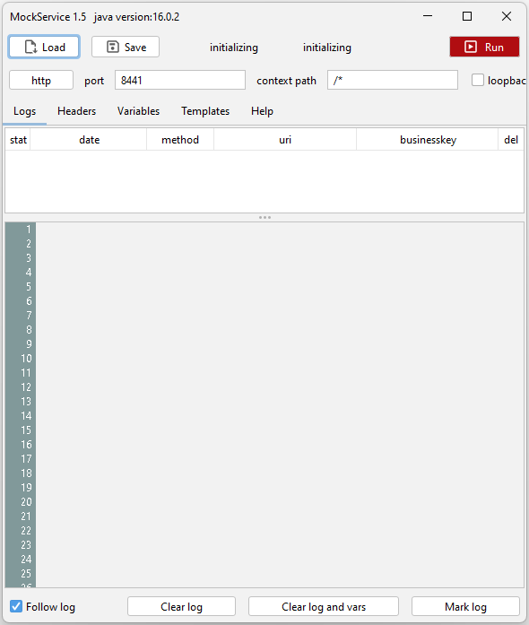

# MockService
Java Swing application for mockservices

The objective for the MockService is to easily create a mockservice for any kind of project.
It generates its response messages using one or more templates. The template can among other information access the payload message from the response.
To use elements from the payload you make use of the variables, that can have xpath or jsonpath selecting values and place them in variables.

The mockservice functions in the following way:

- Receive message and determine method and content-type
- When echo is selected just copy all headers and payload to response

Otherwise
- Resolve all variables using received headers and payload
- Add the headers from the UI headerTable after resolving all headers that use variables
- Parse all templates where the expression evaluates to the given value.
    - the last succesfull parsed template determines the responsecode and contenttype of the response
- when all template evaluations fail the freemarker fallback template is used with the responsecode an contentype that are defined with that

## Headers
In the Headers tab you can add headers to the response message. With copy headers selected the request headers are copied to the response message.
When you want to use a variable as a header just use `$variable_name`
You may also concatenate these varaible names to form one header value.

|header   | value            |
|---------|------------------|
|`header1`| `$var1$var2$var3`|

## Loopback
When selection the echo checkbox the service functions as a loopback service.
It is also possible to have only the headers echoed.

## Variables
In you template and groovy scripts you always have access to the folowing default variables;

|variable           | content       |
|-------------------|---------------|
| `version`         | The version of the Mockservice Tool|
| `templateName`    | the name of the template |
| `payload`         | the message payload from the request |
| `templateFunction`| is the resolver to call functions defined in the variables tab`|
| `method`          | the method of the received request  |
| `context`         | contextpath of the request message  |
| `contentType`     | the contenttype of the received payload message |
| `messagePathInfo` | when using a wildchar * in your contextPath, messagePathInfo is the part that is contained in the wildchar *|
| `templateDir`     | The base templatedir from where the tool loads its files |
| `url_xxxxx`       | when the request has queryparameters they are exposed as variables with the url_ prefix |

In the variables tab you can use a variety of options to transfer data to the freemarker template.
This allows you to set variables or use functions and add namespaces if needed in an xpath.

the variable always has a variable_name. This name can then be directly accessed from the template.
The value of the variable van be just a string or any of the following indicators.

| variable       | expression                 |                                                                                      |
|----------------|----------------------------|--------------------------------------------------------------------------------------|
| `name`           | `const://Harry `                     | fill variable name with constant value Harry                                          |
| `action`         | `transport://my_action?none`         | getst the value of header my_action into the action variable. Default value is none  |
| `responsestring` | `file://response.xml`                | places the content of the file response.xml in the responsestring variable           |
| `elementname`    | `xpath:////user[0]/name?unknown`     |            | 
| `bookname`       | `jsonpath://$..books[0].name?unknown`| documentation  https://github.com/json-path/JsonPath|
| `fileatt`        | `attachment://attname?not found`     | add the attachment of the attachment in the request to the template variable You |
| `ordernumber`    | `expression://context.substring(context.lastIndexOf("/")+1,context.length())` | the expression is evaluated and put in the var |
| `businesskey`    | `templatevar://action`               | set the businesskey. This is visible at the history table items |
| `prefix`         | `context:///mock/v1/api/test/{uid}/user/{zid}` | get the elements from the received uri when the contextpath matches, place the value in prefix_uid and prefix_zid variables |
| `init://var      | `const://10`                         | Initit this variable with name var only when it does not exist yet |

## jsonpath
JsonPath expressions always refer to a JSON structure in the same way as XPath expression are used in combination
with an XML document. The "root member object" in JsonPath is always referred to as `$` regardless if it is an
object or array.

JsonPath expressions can use the dot–notation

`$.store.book[0].title`

or the bracket–notation

`$['store']['book'][0]['title']`

[JSonPath documentation](https://github.com/json-path/JsonPath)

## JSonPath examples

| JsonPath (click link to try)| Result |
| :------- | :----- |
| <a href="http://jsonpath.herokuapp.com/?path=$.store.book[*].author" target="_blank">$.store.book[*].author</a>| The authors of all books     |
| <a href="http://jsonpath.herokuapp.com/?path=$..author" target="_blank">$..author</a>                   | All authors                         |
| <a href="http://jsonpath.herokuapp.com/?path=$.store.*" target="_blank">$.store.*</a>                  | All things, both books and bicycles  |
| <a href="http://jsonpath.herokuapp.com/?path=$.store..price" target="_blank">$.store..price</a>             | The price of everything         |
| <a href="http://jsonpath.herokuapp.com/?path=$..book[2]" target="_blank">$..book[2]</a>                 | The third book                      |
| <a href="http://jsonpath.herokuapp.com/?path=$..book[2]" target="_blank">$..book[-2]</a>                 | The second to last book            |
| <a href="http://jsonpath.herokuapp.com/?path=$..book[0,1]" target="_blank">$..book[0,1]</a>               | The first two books               |
| <a href="http://jsonpath.herokuapp.com/?path=$..book[:2]" target="_blank">$..book[:2]</a>                | All books from index 0 (inclusive) until index 2 (exclusive) |
| <a href="http://jsonpath.herokuapp.com/?path=$..book[1:2]" target="_blank">$..book[1:2]</a>                | All books from index 1 (inclusive) until index 2 (exclusive) |
| <a href="http://jsonpath.herokuapp.com/?path=$..book[-2:]" target="_blank">$..book[-2:]</a>                | Last two books                   |
| <a href="http://jsonpath.herokuapp.com/?path=$..book[2:]" target="_blank">$..book[2:]</a>                | Book number two from tail          |
| <a href="http://jsonpath.herokuapp.com/?path=$..book[?(@.isbn)]" target="_blank">$..book[?(@.isbn)]</a>          | All books with an ISBN number         |
| <a href="http://jsonpath.herokuapp.com/?path=$.store.book[?(@.price < 10)]" target="_blank">$.store.book[?(@.price < 10)]</a> | All books in store cheaper than 10  |
| <a href="http://jsonpath.herokuapp.com/?path=$..book[?(@.price <= $['expensive'])]" target="_blank">$..book[?(@.price <= $['expensive'])]</a> | All books in store that are not "expensive"  |
| <a href="http://jsonpath.herokuapp.com/?path=$..book[?(@.author =~ /.*REES/i)]" target="_blank">$..book[?(@.author =~ /.*REES/i)]</a> | All books matching regex (ignore case)  |
| <a href="http://jsonpath.herokuapp.com/?path=$..*" target="_blank">$..*</a>                        | Give me every thing
| <a href="http://jsonpath.herokuapp.com/?path=$..book.length()" target="_blank">$..book.length()</a>                 | The number of books                      |

Operators
---------

| Operator                  | Description                                                        |
| :------------------------ | :----------------------------------------------------------------- |
| `$`                       | The root element to query. This starts all path expressions.       |
| `@`                       | The current node being processed by a filter predicate.            |
| `*`                       | Wildcard. Available anywhere a name or numeric are required.       |
| `..`                      | Deep scan. Available anywhere a name is required.                  |
| `.<name>`                 | Dot-notated child                                                  |
| `['<name>' (, '<name>')]` | Bracket-notated child or children                                  |
| `[<number> (, <number>)]` | Array index or indexes                                             |
| `[start:end]`             | Array slice operator                                               |
| `[?(<expression>)]`       | Filter expression. Expression must evaluate to a boolean value.    |

Functions
---------

Functions can be invoked at the tail end of a path - the input to a function is the output of the path expression.
The function output is dictated by the function itself.

| Function                  | Description                                                         | Output type |
| :------------------------ | :------------------------------------------------------------------ |:----------- |
| min()                     | Provides the min value of an array of numbers                       | Double      |
| max()                     | Provides the max value of an array of numbers                       | Double      |
| avg()                     | Provides the average value of an array of numbers                   | Double      | 
| stddev()                  | Provides the standard deviation value of an array of numbers        | Double      | 
| length()                  | Provides the length of an array                                     | Integer     |
| sum()                     | Provides the sum value of an array of numbers                       | Double      |
| keys()                    | Provides the property keys (An alternative for terminal tilde `~`)  | `Set<E>`    |
| concat(X)                 | Provides a concatinated version of the path output with a new item  | like input  |
| append(X)                 | add an item to the json path output array                           | like input  |

Filter Operators
-----------------

Filters are logical expressions used to filter arrays. A typical filter would be `[?(@.age > 18)]` where `@` represents the current item being processed. More complex filters can be created with logical operators `&&` and `||`. String literals must be enclosed by single or double quotes (`[?(@.color == 'blue')]` or `[?(@.color == "blue")]`).   

| Operator                 | Description                                                           |
| :----------------------- | :-------------------------------------------------------------------- |
| ==                       | left is equal to right (note that 1 is not equal to '1')              |
| !=                       | left is not equal to right                                            |
| <                        | left is less than right                                               |
| <=                       | left is less or equal to right                                        |
| >                        | left is greater than right                                            |
| >=                       | left is greater than or equal to right                                |
| =~                       | left matches regular expression  [?(@.name =~ /foo.*?/i)]             |
| in                       | left exists in right [?(@.size in ['S', 'M'])]                        |
| nin                      | left does not exists in right                                         |
| subsetof                 | left is a subset of right [?(@.sizes subsetof ['S', 'M', 'L'])]       |
| anyof                    | left has an intersection with right [?(@.sizes anyof ['M', 'L'])]     |
| noneof                   | left has no intersection with right [?(@.sizes noneof ['M', 'L'])]    |
| size                     | size of left (array or string) should match right                     |
| empty                    | left (array or string) should be empty                                |

# templates

For templates we support
- freemarker
- Xslt
- Groovy
- plain text files

## Expressions

for template evaluation we use MVEL2 [MVEL documentation](http://mvel.documentnode.com/)

You can leave out the @{} the expression evalueates like java style syntax.
For strings (templatevars) you may use all String object methods

When no expression is defined the template will always be processed, unless "evaluate all templates" is off and 
another template was already processed.

## Fallback template

The Fallback templates can be edited from the editor in the bottom, also you define the Fallback responsecode and contenttype here.